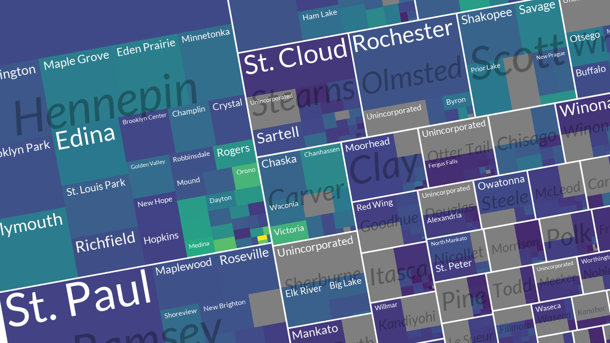
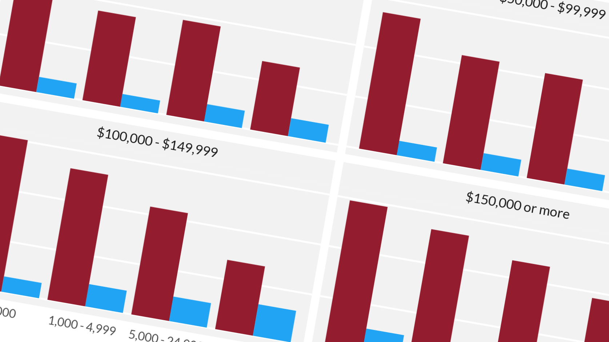

## Portfolio

---

### Maps and graphs 

[3D map of Hennepin Couty population density](/sample_page)

---
[Tree map of city and county population in Minnesota](/pdf/sample_presentation.pdf)

---
[Travel behavior by income and neighborhood population density](http://example.com/)

---
[Bivariate choropleth map of Hennepin County](http://twitter.com/scttdvd)

---

### Category Name 2

- [Project 1 Title](http://example.com/)
- [Project 2 Title](http://example.com/)
- [Project 3 Title](http://example.com/)
- [Project 4 Title](http://example.com/)
- [Project 5 Title](http://example.com/)

---

---

Page template forked from <a href="https://github.com/evanca/quick-portfolio">evanca</a>

<!-- Remove above link if you don't want to attibute -->
